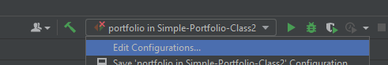
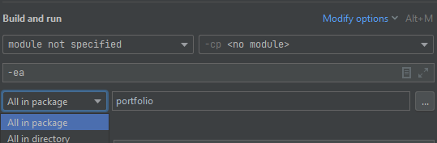
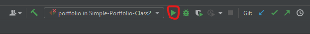

# Description

Construct a simple Portfolio class that has a collection of Stocks and a “Profit” method that receives 2 dates and returns the profit of the Portfolio between those dates. Assume each Stock has a “Price” method that receives a date and returns its price. Bonus Track: make the Profit method return the “annualized return” of the portfolio between the given dates.

# Run tests

In eclipse, go to "Select Run/Debug configuration" -> "Edit configuration".

Go to Build and run section, select All in package and choose portfolio package, then click ok.

Click run

